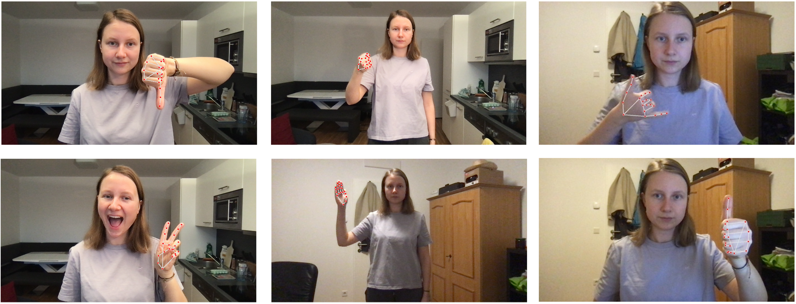
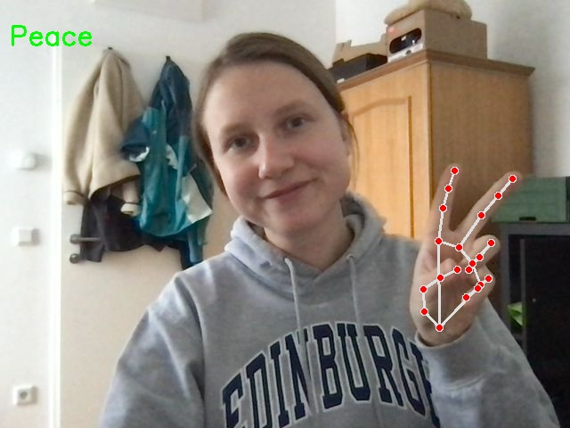

# Computervision Simple Hand-Gesture Project

This is a semester project for the lecture "computer vision" at the university of applied sciences upper austria (FH Hagenberg).

Implemented by Bernadette Ackerl and Fabian Altendorfer.

## Short description
The goal was to implement a robust hand gesture recognition system using computer vision and machine learning techniques. The project aimed to accurately interpret a set of common hand gestures in real-time, regardless of varying lighting conditions, user gender, and spatial positioning relative to the camera. The system leverages advanced technologies such as Python, Mediapipe, TensorFlow, and OpenCV to enhance gesture detection and provide real-time feedback. Six different hand gestures were defined: Thumb-Up, Thumb-Down, Fist, Open-Hand, Peace and Telefon. The project is accompanied by a research paper and comprehensive documentation, both of which are included in this repository.

### Informations about the files in this repo
The generated and used data can be available if you contact Bernadette Ackerl (s2310595001@students.fh-hagenberg.at), because those huge files are saved in her Drive and not provided here in this repo.
But if you want to generate your own data, you can use the **GenerateData.py** file. This example image should demonstrate how the data was generated: 

#### Models
The three trained models are those files where the ending is **.hdf5**

Those models implementations can be found in separate notebooks: **Handgesture_Model_1.ipynb**, **Handgesture_Model_2.ipynb** and **Handgesture_Model_3.ipynb**.

If you want to try a model live, you can use the provided script called: **Testing.py** where you just need to adapt the path-to-model in the code.
The following images demonstrate the useage.
| Show a Gesture | Predicted Gesture |
|---------------|------------------|
|  |  |

The implementation-idea is based on literature review for hand gesture recognition -> MediaPipe.      
